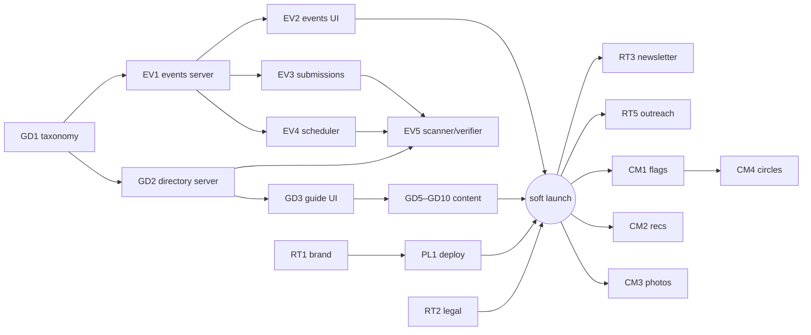

# Overview

Go into plan mode and use this document for your planning. Don't ask for permission to modify it or work in .claude/plans. This is your plan file. Please leave this Overview alone and build the plan in the following sections.

Using the following documents for context:
- [[Brainstorming on the website]]
- [[Setting up the project]]
I'd like to start building an implementation meta document. Basically, I want to distill the work that is going to need to be done into sets of work items / use cases, prioritize and group them, and build a list of implementation buckets with rough overview descriptions of work items groups (like new to seattle guide, coming out resources, event gathering, freshness checking, etc.). The goal is to have buckets that I can then have you take and turn into fully fleshed out separate implementation buckets. Please take an initial stab at this. I feel like we will need to iterate several times. Feel free to ask me about priorities or anything you want feedback and clarity on.

Please create a plan with phases of implementation. Within each phase, please respect the layering of the system and start with the work in lower layers first. Please create checkboxes by work items and then check them off as you implement them. Within the subsections of each phase, please number each such subsection. Please stick to your internal tools to inspect the filesystem and avoid external tools like grep, sed, and awk that you need to prompt me to run. I will build the C++ server and run tests myself. I will also commit and push to GIT myself so please don't use GIT commands unless you really need to understand the history of the files. Please don't prompt me if you can and run prompt requests to completion. Please always add tests for anything you chance for which testing is possible. When building this plan, please create an open questions section for things you need to ask me instead of asking me questions at the prompt.

# What This Document Is

The bridge between the product plan and the build. [[Brainstorming on the website]] (v0.4) says **what and why** — pillars, decisions, research. [[Setting up the project]] (SUTP) says **how, for the platform** — and its Phases 0–9.2 are done (repo, docker, server + client skeletons, auth, admin CRUD, roles). This document distills everything remaining into **implementation buckets**: named, scoped, prioritized chunks of work, each small enough to become its own fully-fleshed implementation doc (`Claude\Bucket <ID> — <Name>.md`) when we activate it.

**Supersession rule:** when a bucket doc exists, it absorbs and supersedes the corresponding SUTP phase sketch (EV1 ≈ SUTP Phase 10, EV2 ≈ 11, EV4 ≈ 12, EV5 ≈ 13, PL3 ≈ 14, PL1 ≈ 15). SUTP stays authoritative for platform conventions, environment facts, and the co-dev/gate workflow. This outline only tracks bucket lifecycle — the real work items, layers, and tests live in each bucket doc.

**Decisions this outline assumes (locked in the brainstorm):** brand Antifreeze @ `gay.antifreezeseattle.com` (pending purchase) · audience = gay men, King County incl. Eastside · adult layer = Q3(b) · KY transparency = fully open · labor = rotating editor + paid-curator trigger · newsletter = Thursday weekly · ads = sponsorships/contextual, never trackers, placement-never-inclusion · no FB/IG scraping · Circles-not-forums (gated). Still open over there: Circles sub-questions, Q9 "agreed," Q10 metric picks, hrs/week budget — tracked in the brainstorm doc, not re-asked here.

# The Buckets

Five tracks. Sizes: **S** ≈ 1–2 working sessions · **M** ≈ a focused week of sessions · **L** ≈ multi-week. Every code bucket follows house rules: lower layers first (db_schema → table_helpers → business logic → endpoints → client), tests at every testable layer, Linux docker gate green per slice, Mason does git.

## Track EV — Events engine (the heartbeat)

- **EV1 — Events domain, server.** The D4 schema as designed in SUTP 10 (venues, event_sources, events, categories + assignments) **plus** what the brainstorm added: `series` grouping for recurring events, scene tags shared with the guide, `manage_events` permission, ingestion idempotency, approve/reject flow. *M · needs GD1 (shared tag vocabulary) · ≈ SUTP 10.*
- **EV2 — Events public UI.** SUTP 11 plus the real-usage views: Tonight / This Weekend / By Scene / By Neighborhood, month calendar, event detail, series pages ("T4T, 2nd Saturdays" as a page), per-event add-to-calendar. The manual loop (admin-entered → approved → visible) is the gate. *M · needs EV1.*
- **EV3 — Submission pipeline.** Public submit form (the single-intake rule stated loudly), pending queue, admin review UI polish, submitter feedback. Light UGC — moderated before publish. *S · needs EV1 + accounts (done).*
- **EV4 — Scheduled jobs.** SUTP 12: `communityfinder_helper` on `honuware_scheduler` — archive past events, token cleanup/hygiene mirror, admin-alerts digest, scheduler service account. *S · needs EV1; platform work (H9) already done.*
- **EV5 — AI scanner & freshness verifier.** SUTP 13 plus the brainstorm's verifier role: per-source volatility cadence, scan_runs audit, verify-mode checks (URL alive, dates sane, closure signals) diffing into a review queue — for events *and* guide listings. The month-18 labor answer. *L · needs EV1, EV4; verification of listings also needs GD2.*

## Track GD — Guide & content (the moat)

- **GD1 — Taxonomy & editorial foundations.** The lowest layer of everything: category + scene-tag vocabularies (shared by events and listings), listing types and their fields (`status`, `last_verified_at`, neighborhood, scene tags, "where this scene talks" links), volatility-tier enum + refresh cadences, voice & style one-pager, page templates, listing-policy draft. Pure data/editorial design — no code. *S · needs nothing. First bucket.*
- **GD2 — Directory data layer, server.** `directory_entries` (or places/organizations split), scene-tag assignments, freshness columns surfaced in payloads, closure-graveyard status handling, `manage_guide` permission, public read endpoints by scene/neighborhood/type, admin CRUD metadata. *M · needs GD1.*
- **GD3 — Guide public UI.** Scene landing pages, venue/org profile pages, neighborhood pages, "Verified {date}" + closed-marker rendering, 18+ interstitial, link-out cards, guide-article rendering for editorial pages. *M · needs GD2.*
- **GD4 — Seed registries load.** The Appendix inventories entered as real data via admin CRUD: ~40 event sources (Wave 1 slice), then venues + orgs + health registries (Wave 2 slice). Content-ops, not code; every entry gets a fresh verification pass on entry. *M, split across waves · needs EV1 / GD2.*
- **GD5 — Nightlife & scenes content.** Venue crowd profiles, scene landings (bears/leather/jocks/sober/elders/geeks/BIPOC), the closure graveyard, "where this scene talks" links. The durable low-volatility editorial core. *M · needs GD3 + GD4.*
- **GD6 — Health & everyday services content.** The corrected 2026 facts (Lifelong→Bailey-Boushay, SCS closed, Kelley-Ross One-Step, PrEP DAP numbers) + affirming-services editorial. Semi-annual refresh tier. *S · needs GD3.*
- **GD7 — New to Seattle.** Neighborhood rundowns (incl. the Eastside as first-class), transit/traffic honesty, first-90-days checklist, moving-because-of-your-state lane with trans-rail link-outs. *M · needs GD3.*
- **GD8 — Freeze directory & "pick your onramp".** The recurring-groups directory (leagues/choruses/climb nights/recovery/faith/professional) + the guided onramp flow (sporty/nerdy/sober/40+/BIPOC/new-in-town/Eastside → matched groups + low-barrier entry events). The wedge, and the brand's namesake. *M · needs GD2/GD3.*
- **GD9 — Coming-out resources.** *(New — your Overview.)* A gay-men-voiced resource guide: coming out later in life, workplace, family and faith contexts, org rails (PFLAG's 5 meetings/month, affirming-congregation directories, the Center), youth = pointer to Lambert House rather than owned content. Link-out-heavy, low-volatility. *S · needs GD3 · scope confirm = OQ3.*
- **GD10 — Adult layer.** Q3(b) as decided: bathhouse pages, Denny Blaine/Howell current-rules pages with dated stamps (monthly refresh during litigation), etiquette/safety/law editorial, naturist orgs, 18+ gate. *S · needs GD3 + the refresh commitment.*

## Track RT — Reach & trust

- **RT1 — Brand & design system.** Logo/wordmark, favicon, Material theme (colors/typography), tagline pick, OG-card design, `site_logo_url`. Blocks nothing until launch but gates it. *S–M · needs the domain/name locked · path = OQ6.*
- **RT2 — Trust & legal pages.** About ("founded and funded by"), listing policy / editorial independence (from GD1's draft), privacy policy, ToS, the counsel review (scoped: MHMDA posture + policies + trademark sanity check). *S + counsel turnaround · needs GD1, RT1-ish.*
- **RT3 — Newsletter.** Provider pick, signup from first deploy, Thursday "This Week in Gay Seattle" digest (hand-assembled first, scheduler-assisted later), archive page. The retention spine. *M · needs EV2 live data.*
- **RT4 — SEO & AI surface.** Event JSON-LD, sitemap, robots.txt allowing OAI-SearchBot/PerplexityBot, Bing Webmaster + GSC, per-category ICS export feeds ("subscribe to bear events"), OG images via the photo pipeline. *S–M · needs EV2/GD3.*
- **RT5 — Launch & outreach.** Soft launch to friends → venue/org cross-promo kits ("you're listed — here's your badge/link"), coopetition outreach (Sapphie Taffy credit/collab, QSC, SGN/SGS, Evvnt publisher signup), Reddit presence policy. Human work, ongoing. *Ongoing · needs a live site.*

## Track CM — Community (each gated on traction + capacity)

- **CM1 — Feedback loops.** "Report stale / closed / new info" flags on every listing → admin queue; org/venue self-service claim + edit-suggestion flow (admin-approved); reader-tips lane. Community-powered freshness — the cheapest real community feature. *S–M · needs GD3.*
- **CM2 — Crowd recommendations.** *(New — your 8/5 comment on the services layer.)* Crowdsourced "who's actually good": logged-in users suggest a business and **recommend** existing ones; listings show recommendation counts ("14 people recommend this barber"); optional short moderated tips. Structurally positive (votes, not rants) so the defamation/moderation surface stays tiny; **free-text reviews deferred** to a later go/no-go with counsel; health-category recommendations shown as **unattributed aggregates only** (MHMDA — a user's name must never attach publicly to "recommends this HIV clinic"). This is the scalable answer to the GSBA gap. *M · needs GD2/GD3 + accounts · shape confirm = OQ4.*
- **CM3 — Event photos.** Platform photo pipeline is built; this adds galleries on events/venues + the consent/no-outing policy. Metro Weekly's proven engagement moat. *S · needs EV2.*
- **CM4 — Circles (+ looking-for-group).** The Q7 model as drafted: bounded member-visible rooms, stewards, no global feed, admin-approved creation, never-empty rule, LFG posts inside circles. Counsel gate + traction gate first. *L · needs CM1 maturity + counsel · last.*

## Track PL — Platform & ops

- **PL1 — CI & deployment.** SUTP 15: GitHub Actions (server + ui jobs, test-count floor), branch protection, release packaging, AWS (EC2/ECS + RDS + S3/CloudFront), DNS + SES/SPF/DKIM on the purchased domain, `server.env` posture. *M–L · needs RT1 minimal + something worth deploying (post-Wave 1).*
- **PL2 — Ops hardening.** Admin-alerts digest wired, per-IP rate limits on public endpoints + ingest, RDS backup/restore runbook, privacy-friendly aggregate analytics, demo/mock seed dataset (doubles as screenshots). *S–M · rides PL1.*
- **PL3 — Multi-community enablement.** SUTP 14, parked until community #2 is real (Tacoma, or the partner-run sister site): control mode, `--create_tenant`, site_meta + admin site-settings page, scheduler fan-out. *M · parked.*

# Dependency spine

**Critical path to launch:** GD1 → EV1 → EV2 → (content + RT2/PL1 in parallel) → soft launch. GD1 is a session of decisions; EV1 is the first real build doc.

# Phased Roadmap (bucket lifecycle tracking)

Checkboxes here track each bucket's lifecycle only: **doc drafted** (bucket doc written + approved by you) and **done** (implemented, gates green, or content published). The detailed work items live in the bucket docs. Within each wave, buckets are ordered lower-layer-first.

## Phase 0 — This outline

### 0.1 Iterate the outline
- [x] Initial bucket distillation from both source docs (8/5/2026)
- [ ] Mason feedback round on bucket cut + wave order (answer Open Questions below)
- [ ] Revise; lock Wave 1 bucket list

## Wave 1 — The working heartbeat *(gate: enter → approve → see it on the local site + calendar)*

### 1.1 GD1 — Taxonomy & editorial foundations
- [ ] Bucket doc drafted · - [ ] Done
### 1.2 EV1 — Events domain, server
- [ ] Bucket doc drafted · - [ ] Done
### 1.3 EV2 — Events public UI
- [ ] Bucket doc drafted · - [ ] Done
### 1.4 GD4a — Seed the event-source registry (~40 sources)
- [ ] Done (rides EV1's admin CRUD; no separate doc)
### 1.5 EV4 — Scheduled jobs
- [ ] Bucket doc drafted · - [ ] Done

## Wave 2 — The guide skeleton *(gate: guide browsable locally with freshness stamps)*

### 2.1 GD2 — Directory data layer
- [ ] Bucket doc drafted · - [ ] Done
### 2.2 GD3 — Guide public UI
- [ ] Bucket doc drafted · - [ ] Done
### 2.3 GD4b — Seed venues/orgs/health registries
- [ ] Done
### 2.4 EV3 — Submission pipeline
- [ ] Bucket doc drafted · - [ ] Done
### 2.5 GD5 — Nightlife & scenes content
- [ ] Bucket doc drafted (content plan) · - [ ] Published
### 2.6 GD6 — Health & services content
- [ ] Bucket doc drafted · - [ ] Published

## Wave 3 — Public launch *(gate: live at the real domain; newsletter #1 sent)*

### 3.1 RT1 — Brand & design system
- [ ] Bucket doc drafted · - [ ] Done
### 3.2 RT2 — Trust & legal pages (+ counsel review)
- [ ] Bucket doc drafted · - [ ] Done
### 3.3 PL1 — CI & deployment
- [ ] Bucket doc drafted · - [ ] Done
### 3.4 RT4 — SEO & AI surface
- [ ] Bucket doc drafted · - [ ] Done
### 3.5 GD7 — New to Seattle · GD8 — Freeze directory & onramp · GD9 — Coming out · GD10 — Adult layer
- [ ] GD7 drafted · - [ ] Published — [ ] GD8 drafted · - [ ] Published — [ ] GD9 drafted · - [ ] Published — [ ] GD10 drafted · - [ ] Published
### 3.6 RT3 — Newsletter
- [ ] Bucket doc drafted · - [ ] First issue sent
### 3.7 RT5 — Soft launch + outreach begins
- [ ] Soft launch to friends · - [ ] First venue/org outreach round

## Wave 4 — The maintenance engine + early community *(gate: a week where the scanner does the checking and outsiders submit events)*

### 4.1 EV5 — AI scanner & freshness verifier
- [ ] Bucket doc drafted · - [ ] Done
### 4.2 CM1 — Feedback loops
- [ ] Bucket doc drafted · - [ ] Done
### 4.3 CM2 — Crowd recommendations (votes + suggestions; reviews deferred)
- [ ] Bucket doc drafted · - [ ] Done
### 4.4 CM3 — Event photos
- [ ] Bucket doc drafted · - [ ] Done
### 4.5 PL2 — Ops hardening
- [ ] Bucket doc drafted · - [ ] Done

## Wave 5 — Gated growth *(each item its own go/no-go)*

### 5.1 CM4 — Circles (+LFG) — counsel + traction gates
- [ ] Go/no-go review · - [ ] Bucket doc drafted · - [ ] Done
### 5.2 CM2b — Free-text reviews go/no-go (counsel)
- [ ] Go/no-go review
### 5.3 PL3 — Multi-community (when community #2 is real)
- [ ] Go/no-go review · - [ ] Bucket doc drafted · - [ ] Done

# How a Bucket Becomes a Doc

Naming: `Claude\Bucket <ID> — <Name>.md`. Standard structure (so you can review them uniformly): **Context** (links here + to the brainstorm sections it implements) → **Scope: in / out** (explicit non-goals) → **Layered work items** (db_schema → table_helpers → business logic → endpoints → client → content, checkboxes, tests named per item) → **Gates** (docker suite + count floor, `ng build` both configs, vitest, manual browser loop where relevant) → **Open Questions** (numbered, in-doc). Division of labor and build conventions inherit from SUTP verbatim (Claude runs Linux gates, Mason does git + Windows spot-checks + all `--recreate_database` runs).

# Open Questions

*(Numbered for inline answers; recommendations included so "agreed" suffices.)*

1. **The bucket cut.** Anything to merge, split, add, or kill? (You said we'd iterate — this is round 1. Obvious candidates either way: EV3 could fold into EV2; GD5/GD6 could merge into one "guide content v1" doc; GD4 could stay checklist-only forever.)
2. **Wave order.** Two deliberate calls to confirm: (a) **the scanner (EV5) lands after launch** — hand-entry + submissions carry the first weeks, scanner arrives as the labor-relief once there's something to maintain; (b) **soft launch waits for Wave 3** (brand + legal + guide content), not Wave 2. *Rec: both as stated; flag if you want scanner earlier or a scrappier earlier launch.*
3. **GD9 coming-out scope.** Proposed: later-in-life lane, workplace, family/faith navigation, org rails (PFLAG, affirming congregations, the Center), youth = pointer to Lambert House only; all gay-men-voiced per Q2; link-out-heavy rather than us writing therapy-adjacent advice. *Confirm or reshape.*
4. **CM2 crowd recommendations (your new idea).** Proposed shape: suggest-a-business + one-click "recommend" with public counts, optional short moderated tips; **no free-text reviews at first** (defamation/moderation surface + §230 uncertainty — separate go/no-go with counsel in Wave 5); health-category recommendations displayed as unattributed aggregates only (MHMDA). Timing: Wave 4, right after launch. *Confirm shape + timing — or pull it earlier if you consider it core to the guide's credibility.*
5. **First bucket docs to spin out.** *Rec: GD1 + EV1 together* — GD1 is a session of shared-vocabulary decisions that EV1's schema consumes; EV1 is the first real build. Say the word and I'll draft both.
6. **RT1 branding path.** Logo/theme via: (a) a designer friend, (b) commissioned, (c) Claude-drafted (SVG wordmark + Material theme + favicon) and iterated with you, upgrade later if it ever matters. *Rec: (c) to unblock launch; it's replaceable.*
7. **Content authorship model.** *Rec:* Claude drafts all editorial from the research appendices; you/Levi/Caleb verify anything requiring feet-on-the-ground truth (venue vibes, gym anecdotes) before publish; every page carries its verified-date stamp. Affects how fast Waves 2–3 content moves.
8. **Status checks that gate Wave 3:** (a) is `antifreezeseattle.com` (± `warmupseattle.com`, `theantifreeze.com`) purchased yet? (b) has the friend review of the brainstorm happened / is it scheduled? (c) the brainstorm's still-open items (Circles sub-questions, Q9 "agreed," Q10 metric picks, hrs/week) — answer there when ready; only hrs/week affects wave pacing here.

# Change Log

- **8/5/2026 (v0.1)** — Initial distillation of [[Brainstorming on the website]] (v0.4) + [[Setting up the project]] (Phases 10–15 + suggested additions) into 26 buckets across 5 tracks (EV events / GD guide / RT reach-trust / CM community / PL platform) with sizes, dependencies, and a 5-wave priority plan; bucket-doc template + supersession rule defined; two new product ideas folded in as buckets (GD9 coming-out resources from the Overview; CM2 crowd recommendations from Mason's 8/5 comment in the brainstorm, with the votes-not-reviews risk shaping); 8 open questions posed for iteration round 1.