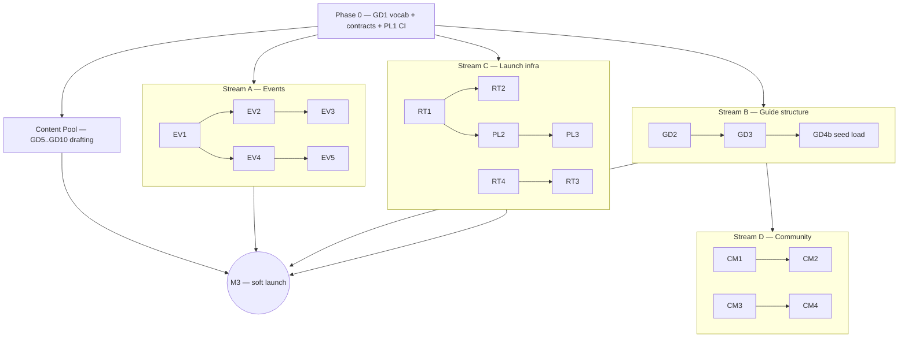

# Overview

Go into plan mode and use this document for your planning. Don't ask for permission to modify it or work in .claude/plans. This is your plan file. Please leave this Overview alone and build the plan in the following sections.

Using the following documents for context:
- [[Brainstorming on the website]]
- [[Setting up the project]]
I'd like to start building an implementation meta document. Basically, I want to distill the work that is going to need to be done into sets of work items / use cases, prioritize and group them, and build a list of implementation buckets with rough overview descriptions of work items groups (like new to seattle guide, coming out resources, event gathering, freshness checking, etc.). The goal is to have buckets that I can then have you take and turn into fully fleshed out separate implementation buckets. Please take an initial stab at this. I feel like we will need to iterate several times. Feel free to ask me about priorities or anything you want feedback and clarity on.

Please create a plan with phases of implementation. Within each phase, please respect the layering of the system and start with the work in lower layers first. Please create checkboxes by work items and then check them off as you implement them. Within the subsections of each phase, please number each such subsection. Please stick to your internal tools to inspect the filesystem and avoid external tools like grep, sed, and awk that you need to prompt me to run. I will build the C++ server and run tests myself. I will also commit and push to GIT myself so please don't use GIT commands unless you really need to understand the history of the files. Please don't prompt me if you can and run prompt requests to completion. Please always add tests for anything you chance for which testing is possible. When building this plan, please create an open questions section for things you need to ask me instead of asking me questions at the prompt.

# What This Document Is

The bridge between the product plan and the build. [[Brainstorming on the website]] (v0.4) says **what and why** — pillars, decisions, research. [[Setting up the project]] (SUTP) says **how, for the platform** — and its Phases 0–9.2 are done (repo, docker, server + client skeletons, auth, admin CRUD, roles). This document distills everything remaining into **implementation buckets**: named, scoped, prioritized chunks of work, each small enough to become its own fully-fleshed implementation doc (`Claude\Bucket <ID> — <Name>.md`) when we activate it. **The organizing principle is parallel ownership** (v0.2, per Mason): three to four people build simultaneously, so buckets are cut to be self-contained and farmable — grouped into four independent work streams plus a content pool, with the few genuine couplings pinned as explicit **Interface Contracts** instead of a global sequence.

**Supersession rule:** when a bucket doc exists, it absorbs and supersedes the corresponding SUTP phase sketch (EV1 ≈ SUTP Phase 10, EV2 ≈ 11, EV4 ≈ 12, EV5 ≈ 13, PL4 ≈ 14, PL1+PL2 ≈ 15). SUTP stays authoritative for platform conventions, environment facts, and the co-dev/gate workflow. This outline only tracks bucket lifecycle — the real work items, layers, and tests live in each bucket doc.

**Decisions this outline assumes (locked in the brainstorm):** brand **Beyond the Freeze**, front-runner domain `beyondthefreeze.com` @ `gay.seattle.beyondthefreeze.com` (endorsed 8/5, OQ10 — final when purchased) · audience = gay men, King County incl. Eastside · adult layer = Q3(b) · KY transparency = fully open · labor = rotating editor + paid-curator trigger · newsletter = Thursday weekly · ads = sponsorships/contextual, never trackers, placement-never-inclusion · no FB/IG scraping · Circles-not-forums (gated). Still open over there: Circles sub-questions, Q9 "agreed," Q10 metric picks, hrs/week budget — tracked in the brainstorm doc, not re-asked here.

# The Buckets

Five tracks. Sizes: **S** ≈ 1–2 working sessions · **M** ≈ a focused week of sessions · **L** ≈ multi-week. Every code bucket follows house rules: lower layers first (db_schema → table_helpers → business logic → endpoints → client), tests at every testable layer, Linux docker gate green per slice, Mason does git.

## Track EV — Events engine (the heartbeat)

- **EV1 — Events domain, server.** The D4 schema as designed in SUTP 10 (venues, event_sources, events, categories + assignments) **plus** what the brainstorm added: `series` grouping for recurring events, scene tags shared with the guide, `manage_events` permission, ingestion idempotency, approve/reject flow. *M · needs GD1 (shared tag vocabulary) · ≈ SUTP 10.*
- **EV2 — Events public UI.** SUTP 11 plus the real-usage views: Tonight / This Weekend / By Scene / By Neighborhood, month calendar, event detail, series pages ("T4T, 2nd Saturdays" as a page), per-event add-to-calendar — **plus the events distribution surface: per-category ICS export feeds and Event JSON-LD** (kept in this bucket so the events stream is fully self-contained; site-wide SEO stays in RT4). The manual loop (admin-entered → approved → visible) is the gate. *M · needs EV1.*
- **EV3 — Submission pipeline.** Public submit form (the single-intake rule stated loudly), pending queue, admin review UI polish, submitter feedback. Light UGC — moderated before publish. *S · needs EV1 + accounts (done).*
- **EV4 — Scheduled jobs.** SUTP 12: `communityfinder_helper` on `honuware_scheduler` — archive past events, token cleanup/hygiene mirror, admin-alerts digest, scheduler service account. *S · needs EV1; platform work (H9) already done.*
- **EV5 — AI scanner & freshness verifier.** SUTP 13 plus the brainstorm's verifier role: per-source volatility cadence, scan_runs audit, verify-mode checks (URL alive, dates sane, closure signals) diffing into a review queue — for events *and* guide listings. The month-18 labor answer. *L · needs EV1, EV4; verification of listings also needs GD2.*

## Track GD — Guide & content (the moat)

- **GD1 — Taxonomy & editorial foundations.** The lowest layer of everything: category + scene-tag vocabularies (shared by events and listings), listing types and their fields (`status`, `last_verified_at`, neighborhood, scene tags, "where this scene talks" links), volatility-tier enum + refresh cadences, voice & style one-pager, page templates, listing-policy draft. Pure data/editorial design — no code. *S · needs nothing. First bucket.*
- **GD2 — Directory data layer, server.** Organizations, places, and guide entries with scene-tag assignments, freshness columns surfaced in payloads, closure-graveyard status handling, `manage_guide` permission, public read endpoints by scene/neighborhood/type, admin CRUD metadata. **Venue guide data lands in a satellite `venue_profiles` table keyed to EV1's `venues`** — Stream B never edits Stream A's files (see Interface Contracts). *M · needs GD1 + the venues contract.*
- **GD3 — Guide public UI.** Scene landing pages, venue/org profile pages, neighborhood pages, "Verified {date}" + closed-marker rendering, 18+ interstitial, link-out cards, guide-article rendering for editorial pages. *M · needs GD2.*
- **GD4 — Seed registries load.** The Appendix inventories entered as real data via admin CRUD: ~40 event sources (Wave 1 slice), then venues + orgs + health registries (Wave 2 slice). Content-ops, not code; every entry gets a fresh verification pass on entry. *M, split by stream: event sources ride Stream A, directory registries ride Stream B · needs EV1 / GD2.*
- **GD5 — Nightlife & scenes content.** Venue crowd profiles, scene landings (bears/leather/jocks/sober/elders/geeks/BIPOC), the closure graveyard, "where this scene talks" links. The durable low-volatility editorial core. *M · needs GD3 + GD4.*
- **GD6 — Health & everyday services content.** The corrected 2026 facts (Lifelong→Bailey-Boushay, SCS closed, Kelley-Ross One-Step, PrEP DAP numbers) + affirming-services editorial. Semi-annual refresh tier. *S · needs GD3.*
- **GD7 — New to Seattle.** Neighborhood rundowns (incl. the Eastside as first-class), transit/traffic honesty, first-90-days checklist, moving-because-of-your-state lane with trans-rail link-outs. *M · needs GD3.*
- **GD8 — Freeze directory & "pick your onramp".** The recurring-groups directory (leagues/choruses/climb nights/recovery/faith/professional) + the guided onramp flow (sporty/nerdy/sober/40+/BIPOC/new-in-town/Eastside → matched groups + low-barrier entry events). The wedge, and the brand's namesake. *M · needs GD2/GD3.*
- **GD9 — "New to…" life-transition guides.** *(Expanded 8/5 per Mason's OQ6 answer — this grew from "coming-out resources" into possibly the strongest original content concept on the site: meet gay men at every fresh start, the way "New to Seattle" meets relocators.)* Ten lanes, each a standalone Pool-farmable page: newly out **older** (what changes vs. a straight-scripted life) · new to a larger gay community · newly single after a long-term relationship · new to non-monogamy · new to being a sober gay · newly non-religious · new to sexual exploration† · new to kink† · new to gay parenting · newly out **young‡**. Placement rules: † lives in/links from the 18+ section per Q3(b); ‡ = **curated pointers only** (Lambert House, Trevor Project, PFLAG) — an adult site with an 18+ layer should route minors to youth-specialist orgs, not own that content. All gay-men-voiced, link-out-heavy over therapy-adjacent advice; shares a "start where you are" surface with Pillar 4's onramps. Research pass needed at bucket-draft time for the parenting / post-religious / newly-single lanes (the appendices already cover sober/kink/community). *M (was S) · needs GD3 · lanes confirmed OQ6.*
- **GD10 — Adult layer.** Q3(b) as decided: bathhouse pages, Denny Blaine/Howell current-rules pages with dated stamps (monthly refresh during litigation), etiquette/safety/law editorial, naturist orgs, 18+ gate. *S · needs GD3 + the refresh commitment.*

## Track RT — Reach & trust

- **RT1 — Brand & design system.** *(Rescoped 8/5 per Mason's OQ8 answer: centralize design from the start, designer friend (Ryan) involved later.)* A Claude-crafted design built **on the honuware tenant-theming machinery**, not beside it — [[Tenant Theming and Branding]] (KY vault, execution-ready 8/4) defines the token catalog (`--theme-primary/accent/…`, status-tone pairs, `--font-display/heading/body` with fonts-as-per-tenant-data, radii), content slots in `config_secrets` via extended `/api/site_info`, and framework-first placement (D11) with the `@honuware/ui` frontend lift scheduled **on CommunityFinder's clock** (its Phase 8). RT1 therefore = (a) the Beyond the Freeze **token value set** + wordmark/logo/favicon + content-slot values + OG-card design, authored in the same two-layer shape as Ryan's Figma Variables so his later involvement is a value-swap, not a rework — we are literally the theming doc's "prove it with a second studio" made real; (b) the CF-side adoption path: consume the theming machinery when its phases land (KY-first per OQ-T7), with the documented fallback of app-side static branding (exactly how KY runs today) if CF launches first. *S–M · needs the domain/name locked + coordination with the theming doc's phases · decided OQ8.*
- **RT2 — Trust & legal pages.** About ("founded and funded by"), listing policy / editorial independence (from GD1's draft), privacy policy, ToS, the counsel review (scoped: MHMDA posture + policies + trademark sanity check). *S + counsel turnaround · needs GD1, RT1-ish.*
- **RT3 — Newsletter.** Provider pick, signup from first deploy, Thursday "This Week in Gay Seattle" digest (hand-assembled first, scheduler-assisted later), archive page. The retention spine. *M · needs EV2 live data.*
- **RT4 — SEO & AI surface (site-wide).** Sitemap, robots.txt allowing OAI-SearchBot/PerplexityBot, Bing Webmaster + Google Search Console registration, OG-image infrastructure via the photo pipeline, structured-data conventions. (Event JSON-LD + ICS feeds moved into EV2 so Stream A is self-contained.) *S · needs a deployable site.*
- **RT5 — Launch & outreach.** Soft launch to friends → venue/org cross-promo kits ("you're listed — here's your badge/link"), competition outreach (Sapphie Taffy credit/collab, QSC, SGN/SGS, Evvnt publisher signup), Reddit presence policy. Human work, ongoing. *Ongoing · needs a live site.*

## Track CM — Community (each gated on traction + capacity)

- **CM1 — Feedback loops.** "Report stale / closed / new info" flags on every listing → admin queue; org/venue self-service claim + edit-suggestion flow (admin-approved); reader-tips lane. Community-powered freshness — the cheapest real community feature. *S–M · needs GD3.*
- **CM2 — Crowd recommendations.** *(New — your 8/5 comment on the services layer.)* Crowdsourced "who's actually good": logged-in users suggest a business and **recommend** existing ones; listings show recommendation counts ("14 people recommend this barber"); optional short moderated tips. Structurally positive (votes, not rants) so the defamation/moderation surface stays tiny; **free-text reviews deferred** to a later go/no-go with counsel; health-category recommendations shown as **unattributed aggregates only** (MHMDA — a user's name must never attach publicly to "recommends this HIV clinic"). This is the scalable answer to the GSBA gap. Mason's caution ("we need to be very careful how we do this," OQ7) is codified as bucket-doc requirements: a design-review gate with Mason before build, a counsel touch on the referral framing, and anti-gaming basics (one recommendation per account per listing, account-age threshold, no self-recommendation by claimed businesses). *M · needs GD2/GD3 + accounts · shape confirmed-with-care, OQ7.*
- **CM3 — Event photos.** Platform photo pipeline is built; this adds galleries on events/venues + the consent/no-outing policy. Metro Weekly's proven engagement moat. *S · needs EV2.*
- **CM4 — Circles (+ looking-for-group).** The Q7 model as drafted: bounded member-visible rooms, stewards, no global feed, admin-approved creation, never-empty rule, LFG posts inside circles. Counsel gate + traction gate first. *L · needs CM1 maturity + counsel · last.*

## Track PL — Platform & ops

- **PL1 — CI + branch protection.** *(Pulled forward for team-parallel work — 3–4 committers need the merge arbiter before the streams fan out.)* GitHub Actions server job (gcc container + postgres service + Conan cache + test-count floor, cloned from `server_components/.github/workflows/ci.yml`) and ui job (`npm ci`, vitest, both builds); branch protection requiring both checks. Roughly a day from the existing template. *S · needs nothing · Phase 0.*
- **PL2 — Deployment.** The rest of SUTP 15: release packaging (Docker image, `build_linux_release.sh` pattern), AWS (EC2/ECS + RDS + S3/CloudFront), DNS + SES/SPF/DKIM on the purchased domain, `server.env` posture, fixed tenant mode. *M · needs RT1 minimal; gates milestone M3.*
- **PL3 — Ops hardening.** Admin-alerts digest wired, per-IP rate limits on public endpoints + ingest, RDS backup/restore runbook, privacy-friendly aggregate analytics, demo/mock seed dataset (doubles as screenshots). *S–M · rides PL2.*
- **PL4 — Multi-community enablement.** SUTP 14, parked until community #2 is real (Tacoma, or the partner-run sister site): control mode, `--create_tenant`, site_meta + admin site-settings page, scheduler fan-out. *M · parked.*

# Interface Contracts (what makes parallel work safe)

The streams stay independent because the genuine couplings are pinned here, agreed once in Phase 0, and not renegotiated mid-flight:

1. **Shared vocabulary (GD1).** One `categories` + `scene_tags` table set, seeded in Phase 0, consumed by events and guide alike. Additions are additive and admin-editable; renames need a cross-stream ping.
2. **The venues entity.** Stream A (EV1) owns the `venues` table exactly as designed in SUTP D4. Stream B adds guide data in a **satellite `venue_profiles` table** (crowd/vibe, scene tags, guide fields) FK'd to `venues.id` — no shared file edits, no schema fights; guide pages join the two.
3. **Freshness convention.** Every listable table carries `status` + `last_verified_at` (definition owned by GD1); each stream applies it to its own tables; EV5's verifier consumes it generically across streams.
4. **Shared-file etiquette.** The genuinely shared files are few and small: `web_app.cpp` (endpoint anchors), the CMakeLists source lists, `app.routes.ts`, the app permission seed. Convention: one-line additions, alphabetized, each PR touches only its own stream's lines — merge conflicts become near-impossible.
5. **URL + permission namespaces.** Stream A owns `/events/*` + `manage_events`; Stream B owns `/guide/*` + `manage_guide`; Stream D owns its community routes + permissions; Streams C/PL own the site chrome. No overlaps.
6. **CI is the arbiter (PL1).** Every stream lands through the same Actions gates + branch protection. The old single-person division of labor generalizes: each stream owner runs their own local docker gates (with their own Claude sessions if they like); git flows through normal PRs once protection is on; destructive DB ops (`--recreate_database`) stay human-run.

# Dependency spine (streams view)

**The only hard cross-stream edges:** Phase 0 feeds everything · Stream D waits on Stream B's GD2/GD3 · milestone M3 pulls one deliverable from each of A/B/C + the Pool. Everything else is internal to a stream.

# Phase 0 — Shared Foundations (the only globally-sequenced work; days, not weeks)

Everything after this fans out to independent owners.

### 0.1 This outline
- [x] Initial bucket distillation from both source docs (8/5/2026)
- [x] Restructured waves → parallel streams per Mason's feedback (8/5/2026)
- [x] Feedback round 2 folded in — bucket cut locked (OQ1), venues + CI decided, GD9 expanded, RT1 rescoped onto the theming machinery, domain front-runner → beyondthefreeze.com (8/5/2026)
- [ ] Stream claims (OQ2) + the go-signal for first bucket docs (OQ5)

### 0.2 GD1 — Taxonomy & editorial foundations *(the shared vocabulary every stream consumes)*
- [ ] Bucket doc drafted
- [ ] Done

### 0.3 Interface contracts locked
- [x] Venues satellite model confirmed (OQ3, 8/5/2026)
- [ ] Namespaces + shared-file etiquette acknowledged by all owners

### 0.4 PL1 — CI + branch protection *(the merge arbiter, pulled forward)*
- [ ] Bucket doc drafted
- [ ] Done

### 0.5 Stream claims
- [ ] Owners named for Streams A–D (OQ2)
- [ ] Content Pool claim board started

# The Work Streams (parallel, one owner each)

Checkboxes track bucket lifecycle only (**doc** = bucket doc drafted + approved; **done** = implemented/published, gates green). Buckets inside a stream run top-to-bottom — that's where the lower-layers-first rule lives; the streams themselves run concurrently.

## Stream A — Events engine *(owner: ________)*

The heartbeat end-to-end: schema → endpoints → UI → intake → automation. Self-contained after Phase 0.

- [ ] EV1 doc · [ ] EV1 done — events domain, server
- [ ] EV2 doc · [ ] EV2 done — events public UI + ICS/JSON-LD
- [ ] GD4a done — seed ~40 event sources (rides EV1's admin CRUD; no separate doc)
- [ ] EV3 doc · [ ] EV3 done — submission pipeline
- [ ] EV4 doc · [ ] EV4 done — scheduled jobs
- [ ] EV5 doc · [ ] EV5 done — scanner & verifier *(fine to start after M3; it's the post-launch labor relief)*

## Stream B — Guide & directory structure *(owner: ________)*

The moat's skeleton: directory schema → guide UI → data load. The editorial content itself lives in the Pool.

- [ ] GD2 doc · [ ] GD2 done — directory data layer (+ `venue_profiles` satellite)
- [ ] GD3 doc · [ ] GD3 done — guide public UI (scenes, profiles, neighborhoods, 18+ gate, link-out cards)
- [ ] GD4b done — seed venues/orgs/health registries
- [ ] GD8-flow done — the "pick your onramp" interactive bit (light code assist for the Pool's Freeze content)

## Stream C — Launch & trust infra *(owner: ________)*

Everything between "works locally" and "live, legal, findable."

- [ ] RT1 doc · [ ] RT1 done — brand & design system
- [ ] RT2 doc · [ ] RT2 done — trust/legal pages + counsel review
- [ ] PL2 doc · [ ] PL2 done — deployment (AWS/DNS/SES)
- [ ] RT4 doc · [ ] RT4 done — site-wide SEO/AI surface
- [ ] RT3 doc · [ ] RT3 done — newsletter *(first issue within 2 weeks of M3)*
- [ ] PL3 doc · [ ] PL3 done — ops hardening
- [ ] RT5 ongoing — outreach rounds (post-M3)

## Stream D — Community features *(owner: ________ — starts once Stream B lands GD2/GD3; its owner opens in the Content Pool or pairs on Stream B)*

- [ ] CM1 doc · [ ] CM1 done — feedback loops (flags / claims / tips)
- [ ] CM2 doc · [ ] CM2 done — crowd recommendations (votes + suggestions; free-text reviews stay a separate go/no-go)
- [ ] CM3 doc · [ ] CM3 done — event photos
- [ ] CM4 go/no-go · [ ] CM4 doc · [ ] CM4 done — Circles (+LFG), counsel + traction gates

## The Content Pool *(farmable to anyone, page-by-page)*

Each item is a standalone mini-doc with no code dependencies on the others; **drafting can start day one** from the research appendices — only *publishing* waits on GD3. Claim by adding a name.

- [ ] GD5 — nightlife & scenes *(claimed: ________)*
- [ ] GD6 — health & services *(claimed: ________)*
- [ ] GD7 — new to Seattle *(claimed: ________)*
- [ ] GD8 — Freeze directory & onramp content *(claimed: ________)*
- [ ] GD9 — coming-out resources *(claimed: ________)*
- [ ] GD10 — adult layer *(claimed: ________)*

# Integration Milestones (sync points, not sequences)

- [ ] **M1 — Events loop live locally.** Stream A: EV1 + EV2 green, GD4a seeded; enter → approve → see it on the list and calendar.
- [ ] **M2 — Guide browsable locally.** Stream B: GD2 + GD3 green, GD4b seeded; ≥1 Pool section published with freshness stamps.
- [ ] **M3 — Public soft launch** *(a checklist pulling one deliverable from each stream, not a phase)*: domain purchased · RT1 · RT2 incl. counsel · PL2 deployed · EV2 with 2+ weeks of real events · GD3 live with GD5-minimum content · RT4 basics. Then: soft launch to friends; RT3 issue #1 within 2 weeks; RT5 outreach begins.
- [ ] **M4 — Maintenance engine on.** EV5 verifying on cadence; CM1 flags live; a week where the humans only review diffs.
- [ ] **M5 — Gated-growth reviews.** CM4 Circles go/no-go (counsel + traction) · CM2b free-text-reviews go/no-go · PL4 when community #2 is real.

# How a Bucket Becomes a Doc

Naming: `Claude\Bucket <ID> — <Name>.md`. Standard structure (so you can review them uniformly): **Context** (links here + to the brainstorm sections it implements) → **Scope: in / out** (explicit non-goals) → **Layered work items** (db_schema → table_helpers → business logic → endpoints → client → content, checkboxes, tests named per item) → **Gates** (docker suite + count floor, `ng build` both configs, vitest, manual browser loop where relevant) → **Open Questions** (numbered, in-doc). Build conventions inherit from SUTP (layering, tests, docker gates, anchors). Bucket docs are written to be **farmed out**: each is executable standalone by one owner (plus their own Claude session) without reading the other bucket docs — anything cross-cutting an owner needs is in this outline's Interface Contracts. With multiple owners, SUTP's single-person division of labor generalizes: each owner runs their stream's local gates, git flows through PRs under PL1's branch protection, and destructive DB ops (`--recreate_database`) stay human-run.

# Open Questions

*(Numbered for inline answers; recommendations included so "agreed" suffices.)*

1. **The bucket cut, round 2.** Now optimized for self-containment (EV2 absorbed ICS/JSON-LD; PL split into CI/deploy/ops/multi; venues handled via satellite table; content split into a farmable pool). Anything to merge, split, add, or kill? (Candidates either way: EV3 could fold into EV2; GD5/GD6 could merge; GD4 could stay checklist-only forever.)
	- Mason- This looks pretty good to me so far.
	- Claude- Locked — the cut stands as-is (8/5); merges/splits can still happen at bucket-doc draft time without disturbing the registry.
2. **Stream claims.** Who owns Stream A (events), B (guide structure), C (launch infra), D (community)? Is there a confirmed 4th person, or do three people cover A/B/C with D + the Pool distributed? Note Stream D starts blocked on B, so its owner should plan to open in the Content Pool or pair on B. Fill the owner blanks in the stream sections.
3. **The venues contract.** Stream A owns `venues` as-designed; Stream B adds a satellite `venue_profiles` table FK'd to it (no shared file edits). *Rec: yes — it's the cleanest parallel-safe cut; the alternative (one merged directory_entries table) couples the two schemas and both owners.*
	- Mason- I'll go with your recommendation.
	- Claude- Decided — satellite `venue_profiles` it is; checked off in Phase 0.3 and pinned in the Interface Contracts.
4. **CI first.** Pull GitHub Actions + branch protection into Phase 0 (PL1) before the streams fan out — with 3–4 committers this is the merge arbiter, and it's ~a day from the `server_components` CI template. *Rec: yes, non-negotiable-grade.*
	- Mason- I'll go with your recommendation.
	- Claude- Decided — PL1 (Actions + branch protection) stays in Phase 0, the first code work after GD1.
5. **First bucket docs to spin out.** *Rec: GD1 (joint, Phase 0) + PL1 (Phase 0) + each claimed stream's opener (EV1 for A, GD2 for B, RT1 for C).* Say the word and I'll draft GD1 + PL1 + EV1 immediately; the rest as streams get claimed.
6. **GD9 coming-out scope.** Proposed: later-in-life lane, workplace, family/faith navigation, org rails (PFLAG, affirming congregations, the Center), youth = pointer to Lambert House only; all gay-men-voiced per Q2; link-out-heavy rather than us writing therapy-adjacent advice. *Confirm or reshape.*
	- Mason - I think that there are many aspects to this:
		- Newly out young (kid, teen, early 20s)
		- Newly out older (differences to expect versus a straight life)
		- New to a larger gay community
		- Newly single after a very long term relationship
		- New to non-monogamy
		- New to being a sober gay
		- Newly non-religious
		- New to sexual exploration
		- New to kink
		- New to gay parenting
	- Claude- This reframe is bigger than the question — it turns "coming-out resources" into a **"New to…" life-transitions family**, the same move that makes "New to Seattle" work: meet people at their fresh start. GD9 is rewritten around your ten lanes (renamed **"New to…" life-transition guides**, size S→M, still Pool-farmable lane-by-lane). Three placement calls baked in — flag if you disagree: **newly-out-young = curated pointers only** (Lambert House / Trevor Project / PFLAG — an adult site with an 18+ section shouldn't own content for minors; routing them to youth specialists is safer and serves them better); **new-to-kink and new-to-sexual-exploration live in/link from the 18+ section** per Q3(b); the other seven lanes are mainstream guide content (non-monogamy handled matter-of-factly — no moralizing in either direction, per the voice rule). Parenting / post-religious / newly-single need a research pass at bucket-draft time; the appendices already cover the sober/kink/community lanes.
7. **CM2 crowd recommendations (your idea).** Proposed shape: suggest-a-business + one-click "recommend" with public counts, optional short moderated tips; **no free-text reviews at first** (defamation/moderation surface + §230 uncertainty — separate go/no-go with counsel at M5); health-category recommendations displayed as unattributed aggregates only (MHMDA). Slot: early Stream D. *Confirm shape — or promote it if you consider it core to the guide's credibility at launch.*
	- Mason- I definitely want to have a referral area but we need to be very careful to how we do this.
	- Claude- Confirmed with your caution built in — CM2's description now carries the care requirements as bucket-doc gates: a design review with you before anything gets built, a counsel touch on the referral framing, and anti-gaming basics (one recommendation per account per listing, an account-age threshold, claimed businesses can't recommend themselves). Votes-not-reviews stays the launch shape; free-text reviews remain a separate counsel-gated go/no-go.
8. **RT1 branding path.** Logo/theme via: (a) a designer friend, (b) commissioned, (c) Claude-drafted (SVG wordmark + Material theme + favicon) and iterated, upgraded later if it ever matters. *Rec: (c) to unblock launch; it's replaceable.*
	- Mason- We should try to centralize design from the start but plan on my designer friend getting involved. With that in mind please craft a Claude based, consistent design keeping these in mind:
		- C:\Users\mason\Documents\Obsidian\Knotty Yoga\Claude\Component Inventory for Designer.md
		- C:\Users\mason\Documents\Obsidian\Knotty Yoga\Claude\Tenant Theming and Branding.md
		- C:\Users\mason\Documents\Obsidian\Knotty Yoga\Claude\Website Makeover.md
	- Claude- Decided — and reading those three docs, this is much better than "draw a logo." KY's makeover runs on a **two-layer token system** (Ryan's Figma Variables ↔ CSS custom properties), and [[Tenant Theming and Branding]] (execution-ready as of 8/4) makes branding **per-tenant data on honuware**: token values (`--theme-*`, `--font-*` with fonts-as-data, radii), content slots in `config_secrets`, imagery — all served through the extended `/api/site_info`, framework-first (its D11), with the `@honuware/ui` frontend lift explicitly scheduled **on CommunityFinder's clock** (its Phase 8). RT1 is rescoped accordingly (see the bucket): I author the Beyond the Freeze **token value set + wordmark + favicon + content-slot values** in exactly Ryan's variable shape — we're literally the theming doc's "prove it with a second studio" made real — so Ryan's later involvement is a value-swap, not a redesign. Fallback if CF launches before the theming phases land: app-side static branding exactly as KY runs today, tokens adopted when the machinery ships.
9. **Content authorship model.** *Rec:* Claude drafts all Pool editorial from the research appendices; humans claim sections for the feet-on-the-ground verification pass (venue vibes, gym anecdotes) before publish; every page carries its verified-date stamp.
	- Mason- This sounds great to me.
	- Claude- Decided — Claude drafts from the research, humans verify the feet-on-the-ground facts before publish, every page stamps its verified date.
10. **Status checks that gate M3:** (a) is `antifreezeseattle.com` (± `warmupseattle.com`, `theantifreeze.com`) purchased yet? (b) has the friend review of the brainstorm happened / is it scheduled? (c) the brainstorm's still-open items (Circles sub-questions, Q9 "agreed," Q10 metric picks, hrs/week) — answer there when ready; hrs/week-per-person now matters mostly for how many streams run truly concurrently.
	- Mason- We are leaning towards beyondthefreeze.com. What do you think?
	- Claude- **Endorsed — go with `beyondthefreeze.com`** (unregistered as of the 8/1 sweep; the land-rush warning stands, so buy it this week). Three things tipped me off my earlier antifreezeseattle lean: (1) **it restores your original two-axis dream on a single apex** — `gay.seattle.beyondthefreeze.com`, then `gay.portland.…`, `trans.seattle.…` with partners — no per-city domain purchases, ever; (2) **your team is already planning around it** — the KY [[Tenant Theming and Branding]] doc records CommunityFinder as `gay.seattle.beyondthefreeze.com` (8/4) and resolved its tenant-granularity question around exactly this shape (tenant per subdomain, own database each, zero new honuware work) — this outline was the document out of step; (3) as a brand, "Beyond the Freeze" trades Antifreeze's punchy-noun energy for a warmer, mission-forward read that names the arc — past the Freeze, into community — which fits a site whose wedge is belonging ("antifreeze" survives as tagline vocabulary). Optional $12 defensive: also register `antifreezeseattle.com`, since it's been discussed in writing. Brand references in both docs now read Beyond the Freeze, marked final-when-purchased — say when it's bought and I'll close Q1/OQ10 everywhere.

# Change Log

- **8/5/2026 (v0.3)** — Mason's OQ round folded in: OQ1 cut locked · OQ3 venues satellite ✓ (Phase 0.3 checked) · OQ4 CI-first ✓ · OQ6 **GD9 reframed into the "New to…" life-transition guides family** (ten lanes; young lane = pointers-only, kink/exploration lanes = 18+ placement; S→M) · OQ7 CM2 confirmed-with-care (design-review gate, counsel touch, anti-gaming basics added) · OQ8 **RT1 rescoped onto the honuware tenant-theming machinery** (token values + content slots in Ryan's Figma-variable shape; CF = the theming doc's real "second studio"; `@honuware/ui` lift rides CF's clock per its Phase 8; static-branding fallback documented) · OQ9 authorship model ✓ · OQ10 **domain front-runner flipped to `beyondthefreeze.com` (endorsed)** — single apex restores the `{audience}.{city}` two-axis scheme and matches the KY theming doc's as-planned architecture; final when purchased. Still open: OQ2 stream claims, OQ5 go-signal.
- **8/5/2026 (v0.2)** — **Waves dropped for parallel ownership**, per Mason (3–4 people working concurrently): buckets re-cut for self-containment (EV2 absorbs event ICS/JSON-LD; RT4 shrinks to site-wide; PL split into PL1 CI [pulled into Phase 0 as the merge arbiter] / PL2 deploy / PL3 ops / PL4 multi-community; GD2 takes the `venue_profiles` satellite so Streams A/B never touch each other's files); new **Interface Contracts** section (shared vocabulary, venues contract, freshness convention, shared-file etiquette, namespaces, CI-as-arbiter); roadmap restructured into **Phase 0 shared foundations → four owned Streams (A events / B guide structure / C launch infra / D community) + a farmable Content Pool → Integration Milestones M1–M5** with owner/claim blanks; bucket-doc template gains the farm-out rule (standalone-executable, contracts referenced); Open Questions rebuilt (10) around stream claims, the venues contract, and CI-first.
- **8/5/2026 (v0.1)** — Initial distillation of [[Brainstorming on the website]] (v0.4) + [[Setting up the project]] (Phases 10–15 + suggested additions) into 26 buckets across 5 tracks (EV events / GD guide / RT reach-trust / CM community / PL platform) with sizes, dependencies, and a 5-wave priority plan; bucket-doc template + supersession rule defined; two new product ideas folded in as buckets (GD9 coming-out resources from the Overview; CM2 crowd recommendations from Mason's 8/5 comment in the brainstorm, with the votes-not-reviews risk shaping); 8 open questions posed for iteration round 1.